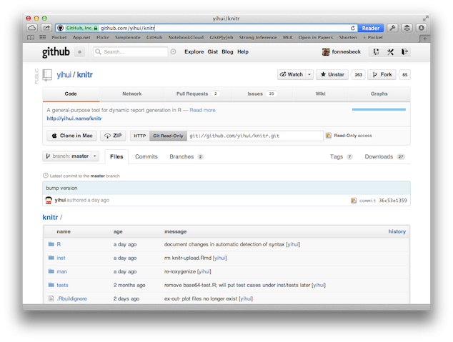
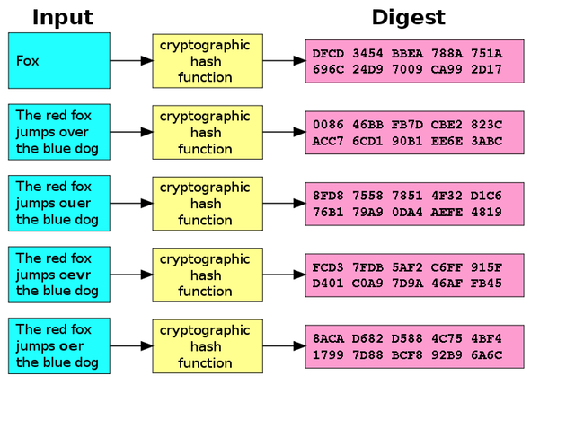
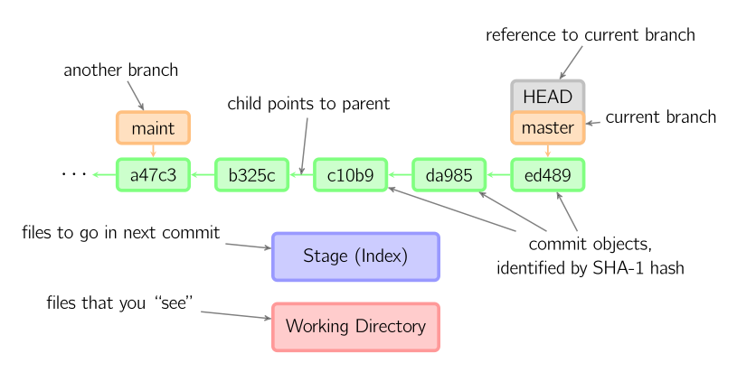
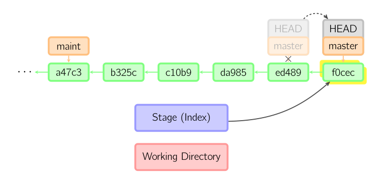
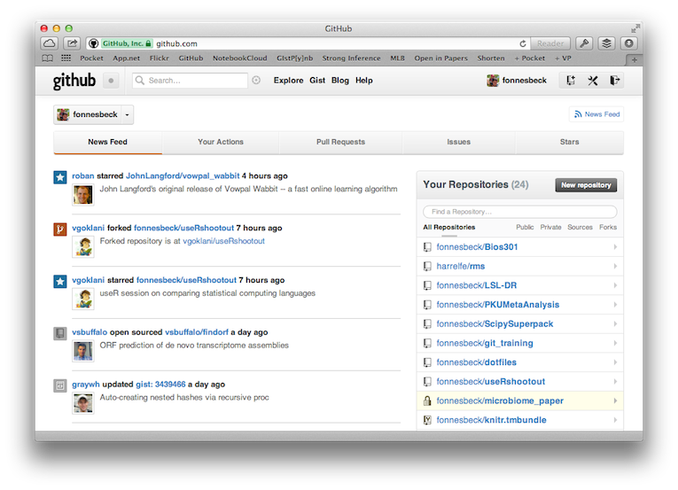
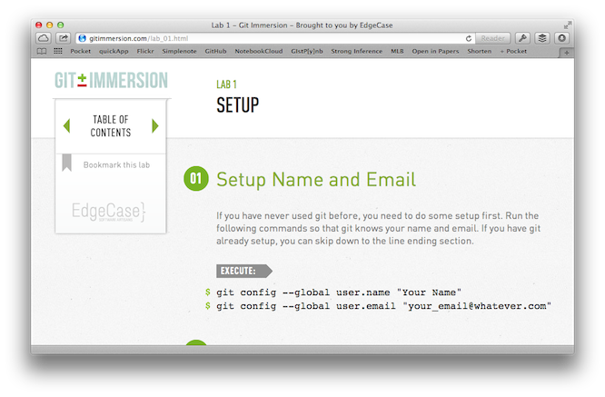

# Version Control using Git

# Presenter Notes

Version control is used widely by software developers, but can be employed very widely, by anyone who creates and edits documents of any kind, not just source code.

---

Programming Workflow
====================

1. Create
2. Save
3. Edit
4. Save again
5. Edit
6. Save again
7. ...

A ***better*** workflow would include tracking the history of the changes that took place, and the ability to roll back changes when necessary.

A **version control system** (or source code management system) is a systematic tool for managing documents, computer programs, large web sites, and other collections of information that are revised by groups or individuals.

# Presenter Notes

This is particularly important when collaborating on projects with others, when multiple people are editing the same set of documents, data or source code. We need to know who changed what, when they did it, and why. In the absence of a version control system, developers have had to resort to making "backup" copies of entire folders of code each time they made significant changes, or handed it off for collaborators to contribute.

---

What is Git?
============

A *fast*, *modern* system for version control.

- complete history of changes
- (relatively) easy to learn and use
- distributed

Git is a **directory content management system**

# Presenter Notes

- control of both individual and collaborative projects. 
- large and powerful set of commands
- a few core functions, which allow it to be used by non-experts, and learned progressively. 
- used both on and offline, rather than having to be constantly connected to a central server. 
- Like UNIX, Git is composed of several discrete functions that work together to a common purpose.

---

# 3 Stages of Git

# Presenter Notes

There are three stages to using Git:

1. working
2. staging ("shopping cart")
3. committing to repository ("permanent history")

---

The `git` Command
=================

The `git` command line tool is used in conjunction with a command and optional arguments.

    $ git
    usage: git [--version] [--exec-path[=<path>]] [--html-path] [--man-path] [--info-path]
               [-p|--paginate|--no-pager] [--no-replace-objects] [--bare]
               [--git-dir=<path>] [--work-tree=<path>] [--namespace=<name>]
               [-c name=value] [--help]
               <command> [<args>]

# Presenter Notes

Notes

---

Git in Action
=============

Initialize a repository:

    !bash
    $ git init my_analysis

Add some new work:

    !bash
    $ cd my_analysis
    $ touch fast_code.R
    $ git add .

Commit your changes:

    !bash
    $ git commit -m "Added some fast code!"

# Presenter Notes

Note that a repository ("repo") can reside anywhere, either on your local machine, on a remote server, or in most cases, both.

---

Merging Work on Separate Branches
=================================

Git allows individuals to work separately, but then be able to merge their work with either the work of others or their own previous work in a logical, streamlined fashion. 

    !bash
    git checkout master
    # Do some stuff
    git commit -a -m "Updated documentation"
    git push
    
    git checkout new_feature
    # Do some other stuff
    git commit -a -m "Added a new function"
    git push origin master
    
    git checkout master
    git pull
    git merge new_feature 

This applies even when the same document (or even the same sections of a document) are being edited by multiple people.

# Presenter Notes

---

Git in Action
=============

Git allows you to control and automate how changes are merged

     $ git log --graph --decorate --abbrev-commit --all --pretty=oneline
     
     * 6de3c47 (cython) Deleted old cython code locations; continued tweaking cdistir
     * 4e2e329 Moved cython code to src; began moving from flib to gsl
     * 2e40665 More progress on cythonization
     * bd6010a Began cythonization. Changed Container_values and LazyFunction to Cyth
     | *   8c28e9d (HEAD, origin/master, origin/HEAD, master) Merge pull request #115
     | |\  
     |/ /  
     | * b1b714c HDF5EA: Load meta info from existing file.
     | * 304e667 Rename hdf52 to hdf5ea, basic functionality works now.
     | * 7591091 Initial work on using EArray in HDF5.
     * |   b0daa21 (origin/2.2, 2.2) Merge pull request #114 from memmett/master
     |\ \  
     | |/  
     | * 756d775 SQLITE: Tweak CREATE TABLE statement and don't catch exceptions.
     |/  
     * c903738 (tag: v2.2) Changed version to 2.2
     * e421f64 Fixed issue #111

# Presenter Notes

Git helps you manage situations when multiple changes are in conflict with one another. 
While Git can be kept simple, it is also flexible and powerful enough for power users.
Notice that the log of changes looks very much like a journal of the development of the project.
---

Git Configuration
=================

The first step in using Git for the first time is to configure your user name and email.

    !bash
    $ git config --global user.name "Moe Szyslak"
    $ git congig --global user.email "moe@moesbar.com"    

This will create a *.gitconfig* file in your home directory with a very simple structure:

    !bash
    $ cat ~/.gitconfig
      [user]
              name = Moe Szyslak
              email = moe@moesbar.com

# Presenter Notes

If you ever change your email address, for example, you can either run the command again, or simply edit the *.gitconfig* file directly.
The *--global* flag indicates that these values are to be applied system-wide; you can override the values for specific projects by running the commands without this flag within the project's directory.
---

Create a repository
===================
 
Creating a new repository:

    !bash
     $ git init firstrepo
    
    Initialized empty Git repository in /Users/fonnescj/firstrepo/.git/

Converting existing code into a repository:

    !bash
    $ cd firstrepo
    $ git init
 
# Presenter Notes
 
Have a look at the `.git` directory that is created. This is the only thing that Git adds to the file structure.

--- 

Checking the Status
===================

The `git status` command is used to monitor the state of the repository and of the working directory.

    !bash
    $ git status
    # On branch master
    nothing to commit (working directory clean)

Adding content to the working directory is picked up by Git.

    !bash
    $ touch model.r
    $ git status
    
    # On branch master
    #
    # Initial commit
    #
    # Untracked files:
    #   (use "git add <file>..." to include in what will be committed)
    #
    #   model.r
    nothing added to commit but untracked files present (use "git add" to track)

# Presenter Notes

Here, the `status` command reports that there are no outstanding changes to record. This means that the repository has the same state as that of the working directory.
Creating a file then checking the status of the repo will show that Git is aware of the file, but views it as *untracked*. Notice that at the bottom of the message, Git gives you a hint about what to do next.

---

The Staging Area
================

Let Git know you intend to include content in the next commit using `git add`.

    !bash
    $ git add model.r
    
    # On branch master
    #
    # Initial commit
    #
    # Changes to be committed:
    #   (use "git rm --cached <file>..." to unstage)
    #
    #   new file:   model.r
    #

We can add all modified files simultaneously by the syntax:

    !bash
    $ git add .

*Why do we need a staging area?*

# Presenter Notes

This does not commit the file straight away, but rather, puts it in a staging area, where it is ready to be committed alongside other (perhaps related) files.
It makes it easier to gather a set of related changes to be committed as a meaningful unit. 
It also adds a layer of protection from accidentally committing changes that were unintended.

---

Don't be Afraid to Commit
=========================

An explicit `commit` command is then executed to formally give the file membership in the repository:

    !bash
    $ git commit -m "Draft of first model"

    [master (root-commit) cace59c] Draft of first model
     0 files changed
     create mode 100644 model.r

A (mandatory) commit message has been added, using the `-m` flag.

# Presenter Notes

Notes

---

How is Git Different?
=====================

Git is an **opt-in** system: you must explicitly specify which files are included in a given commit.

Git is a **distributed** system: there is no central repository; each clone is a first-class version of the repo.

Git operates **offline**: in the above transactions there was no network activity. 

# Presenter Notes

Git interacts with remote repositories only when explicitly asked to do so, via `push`, `pull` and other remote commands.

---

It's All About Content
======================

Git manages files in any particular repository based on the *content* of those files. Other changes are ignored:

    !bash
    $ mkdir docs
    $ git status
    # On branch master
    nothing to commit (working directory clean)

What if we change the access timestamp of a file?

    !bash
    $ touch model.r
    $ git status
    # On branch master
    nothing to commit (working directory clean)

# Presenter Notes

There is no content in an empty directory.
`touch` does not change a file's contents.

---

It's All About Content
======================

    !bash
    $ echo 'library(ggplot2)' >> model.r
    $ git status
    # On branch master
    # Changes not staged for commit:
    #   (use "git add <file>..." to update what will be committed)
    #   (use "git checkout -- <file>..." to discard changes in working directory)
    #
    #   modified:   model.r
    #
    no changes added to commit (use "git add" and/or "git commit -a")

Now we have changed the contents of our file, so it appears as *modified* in Git.

# Presenter Notes

Notes

---

Removing Files
==============

Let's try adding a file to the repository ...

    !bash
    $ touch badfile.txt
    $ git add badfile.txt
    $ git commit -m "Here's a new file"

... and then remove it.

    !bash
    $ rm badfile.txt
    $ git status
    
    # On branch master
    # Changes not staged for commit:
    #   (use "git add/rm <file>..." to update what will be committed)
    #   (use "git checkout -- <file>..." to discard changes in working directory)
    #
    #   deleted:    badfile.txt
    #
    no changes added to commit (use "git add" and/or "git commit -a")

The file does not exist in our working directory any longer, but Git notices that it is gone!

# Presenter Notes

Simply removing a file by throwing it in the trash does not remove it from the repository; it only registers as a modification of the file.

---

Removing Files
==============

The command for removing files from being tracked by Git is `git rm`.

    !bash
    $ git rm badfile.txt
    
    rm 'badfile.txt'
    
    $ git status
    
    # On branch master
    # Changes to be committed:
    #   (use "git reset HEAD <file>..." to unstage)
    #
    #   deleted:    badfile.txt
    #

Now the change is staged to be committed, and the file will no longer be tracked by the repository.

# Presenter Notes

Note that evidence of its previous existence still appears in the git log. 
Later, we will show you how to retrieve files deleted from the repository, if you decide later that you need them.

---

Exercise
========

### Try renaming a file under version control

# Presenter Notes

Notes

---

Renaming Files
==============

    !bash
    $ mv badfile.txt goodfile.txt
    $ git status
    
    # On branch master
    # Changes not staged for commit:
    #   (use "git add/rm <file>..." to update what will be committed)
    #   (use "git checkout -- <file>..." to discard changes in working directory)
    #
    #   deleted:    badfile.txt
    #
    # Untracked files:
    #   (use "git add <file>..." to include in what will be committed)
    #
    #   goodfile.txt
    no changes added to commit (use "git add" and/or "git commit -a")

Similar to deleting files, you cannot change the name of a file without doing so through Git.

# Presenter Notes

So, as far as Git is concerned, you have deleted `badfile.txt` and created `goodfile.txt`, which is currently not tracked.

---

Renaming Files
==============

For the change to be propagated as a renaming action, use `git mv`:

    !bash
    $ git mv badfile.txt goodfile.txt
    $ git status
    
    # On branch master
    # Changes to be committed:
    #   (use "git reset HEAD <file>..." to unstage)
    #
    #   renamed:    badfile.txt -> goodfile.txt
    #

# Presenter Notes

---

Ignoring Files
==============

Just because a file exists in your working directory, it does not necessarily imply that you want to track it with the repository.

- e.g., temporary files, program output, log files, private content

A `.gitignore` file in any repo directory can be used to omit files from tracking in that directory, and its subdirectories.

    !bash
    $ more .gitignore
    .Rhistory
    email.txt
    *.log
    *.aux
    *.fdb_latexmk
    *.out
    *.synctex.gz
    *.toc

# Presenter Notes

we do not want our status messages to be cluttered with files that Git can see but does not track.

---

Ignoring Files
==============

For example, lets create some phony log files in our working directory:

    !bash
    $ touch foo.log bar.log

If we check the status, these two files will appear in the list of untracked files.

    !bash
    $ git status
    # On branch master
    # Untracked files:
    #   (use "git add <file>..." to include in what will be committed)
    #
    #   foo.log
    #   bar.log
    # nothing added to commit but untracked files present (use "git add" to track)

However, if our `.gitignore` file contains `*.log`, all files ending in *.log* will be ignored, even though they are still in the working directory, and are not tracked by the repository. 

---

Branches
========

When you create a new repository, by default you create a *branch* within that repository called `master`. You are free to create as many additional branches as you want:

    git branch <new branch name>

Additional branches allows you to work on additional code, without potentially disturbing the work in your `master` branch. You can easily switch between branches, merge the work of two branches, or simply discard branches as needed.

**Branches are free, use them!**

    $ git branch experimental
    $ git branch
      experimental
    * master

# Presenter Notes

---

Branching and Merging
=====================

Let's create something in our new `experimental` branch:

    !bash
    $ git checkout experimental
    Switched to branch 'experimental'
    $ touch new_stuff.r
    $ git add .
    $ git commit -m "Fancy new code"
    [experimental 136c847] Fancy new code
     0 files changed
     create mode 100644 new_stuff.r

Now we can switch back to the `master` branch and merge the new code.

    !bash
    $ git checkout master
    Switched to branch 'master'
    $ git merge experimental
    Updating 8fb82d3..136c847
    Fast-forward
     0 files changed
     create mode 100644 new_stuff.r

# Presenter Notes

---

Cloning
=======

Its easy to make an identical copy of a given repository using `git clone`

    $ cd ..
    $ git clone firstrepo firstrepo_clone
    Cloning into 'firstrepo_clone'...
    done.

Have a look around ... they're the same!

    $ cd firstrepo_clone
    $ git hist --all
    * fa0d6a5 2012-07-02 | renamed badfile to goodfile (HEAD, origin/master, origin/
    * 0e0cfca 2012-07-02 | Here's a new file again [Christopher Fonnesbeck]
    * 98a6415 2012-07-02 | Deleted badfile [Christopher Fonnesbeck]
    * 770fa5e 2012-07-02 | Here's a new file [Christopher Fonnesbeck]
    * cace59c 2012-06-25 | Draft of first model [Christopher Fonnesbeck]
    (END) 

# Presenter Notes

---

Cloning
=======

Cloning is most relevant when you want to get a copy of someone else's repository. For example, let's take a look at `knitr`:

# Presenter Notes

---

Cloning
=======

    $ git clone git://github.com/yihui/knitr.git
    Cloning into 'knitr'...
    remote: Counting objects: 9337, done.
    remote: Compressing objects: 100% (2755/2755), done.
    remote: Total 9337 (delta 6646), reused 9207 (delta 6520)
    Receiving objects: 100% (9337/9337), 1.36 MiB | 1.86 MiB/s, done.
    Resolving deltas: 100% (6646/6646), done.

I now have an identical, first-class copy of Yihui Xie's `knitr` repo!

    $ cd knitr
    $ git hist --all
    * 36c53e1 2012-08-23 | bump version (HEAD, origin/master, origin/HEAD, master) [
    * 52146d4 2012-08-23 | re-roxygenize [Yihui Xie]
    * 961e88c 2012-08-23 | document changes in automatic detection of syntax [Yihui 
    * c02ba37 2012-08-23 | *.brew corresponds to pat_brew() [Yihui Xie]
    * 5df1117 2012-08-23 | detect_pattern() puts higher priority on the file extensi
    * 1178425 2012-08-23 | rm knitr-upload.Rmd [Yihui Xie]
    :

# Presenter Notes

try installing it ...

---

Exercise
========

### Clone the Bios301 course repository at 

    http://github.com/fonnesbeck/Bios301

# Presenter Notes

Show what happens when I change something on the repo.

---

Hashes
======

Git identifies the uniqueness of all its content using *hashcodes*. 

    $ git log
    commit fa0d6a5c6b03c0224fa87879a6454911a41400c9
    Author: Christopher Fonnesbeck <chris.fonnesbeck@vanderbilt.edu>
    Date:   Mon Jul 2 13:55:01 2012 -0500

        renamed badfile to goodfile

    commit 0e0cfcad18d7ceb1d9637f1e4184b98a46e9df18
    Author: Christopher Fonnesbeck <chris.fonnesbeck@vanderbilt.edu>
    Date:   Mon Jul 2 13:43:47 2012 -0500

        Here's a new file again

A hashcode is a mapping of some quantity of data to a much smaller dataset that uniquely identifies the original dataset. 

This is done using one of several *hashing algorithms*.  

### But, why??

# Presenter Notes

One typically encounters hashcodes and hashing algorithms in the context of security, but Git uses this relationship to identify the content of files, and hence, to reliably track changes in file content.

---

Hashes
======

Git uses the [SHA-1 hashing function](http://en.wikipedia.org/wiki/SHA-1) to encode the files that it tracks.

# Presenter Notes

a file of arbitrary size is converted into a unique 160-bit string of characters

---

Hashes
======

Everything stored in a Git repository is indexed with its own SHA-1 hashcode. For example, each commit in the history is associated with a hashcode.

    $ git log --pretty=oneline
    fa0d6a5c6b03c0224fa87879a6454911a41400c9 renamed badfile to goodfile
    0e0cfcad18d7ceb1d9637f1e4184b98a46e9df18 Here's a new file again
    98a64155f562d40179ac53c551ee0f2670bdb203 Deleted badfile
    770fa5e1ed514a8eef10ddb7013a9f47fadfa98f Here's a new file
    cace59c0bc7feead6cebcaed893ead508770cf28 Draft of first model

What gets a hash?

- BLOBs
- trees
- commmits
- tags

---

Hash Collisions
===============

Since we are using 160 bits to uniquely identify the contents of every file, commit, tree or tag, one might expect **collisions** to arise occasionally.

If we assume:

- 10 billion humans are programming
- They *each* produce 5000 git objects every day
- They all push to the same huge repository
- They keep this up for 50 years

Then, the probability of getting a hash collision 6e-13.

*No one has ever found a SHA-1 collision.*

# Presenter Notes

---

Your Commit History
===================

`git log` command accesses the record of all the transactions that have been executed under git for the project from which you call it. 

    $ git log
    commit fa0d6a5c6b03c0224fa87879a6454911a41400c9
    Author: Christopher Fonnesbeck <chris.fonnesbeck@vanderbilt.edu>
    Date:   Mon Jul 2 13:55:01 2012 -0500
    
        renamed badfile to goodfile
        
    commit 0e0cfcad18d7ceb1d9637f1e4184b98a46e9df18
    Author: Christopher Fonnesbeck <chris.fonnesbeck@vanderbilt.edu>
    Date:   Mon Jul 2 13:43:47 2012 -0500
    
        Here's a new file again

- unique commit hash
- name and address of the committer
- date of the commit
- mandatory commit message.

---

Your Commit History
===================

A combination of arguments to `git log` can be used to obtain a customized display of information:

    $ git log --graph --decorate --abbrev-commit --all --pretty=oneline
    * a33b026 Update master
    * 98a2195 Fixed binning formula bug #120
    * 6be5297 Fixed test directory in test_MCMCSampler.py
    * 16d0b9e Fixed pickle commit bug.
    * 4dbb9d0 Fixed coda_output and bug in Doane's binning formula.
    * 15222e3 Improved binning options for histograms.
    * 3966c74 Fixed issue #118 in utils.coda()
    * f94b148 Restored numpy error settings
    *   8c28e9d Merge pull request #115 from memmett/hdf5-earray
    |\  
    | * b1b714c HDF5EA: Load meta info from existing file.
    | * 304e667 Rename hdf52 to hdf5ea, basic functionality works now.
    | * 7591091 Initial work on using EArray in HDF5.
    | | * 1224865 (origin/gh-pages, gh-pages) Updated windows install instructions

We now see information regarding the various branches, an abbreviated hashcode, and a graph that indicates where code branches were created and merged.

---

Filtering Commit History
========================

Another powerful use of `git log` is for *filtering* the commit history, according to desired criteria. 

For example, if we want to see all commits from one month ago until yesterday, limiting the number returned to a maximum of 30 records, we can type:

    $ git log -n 30 --since='1 month ago' --until=yesterday
    commit d159a3b9adba4116722cbddf7ca2b56506ba159d
    Author: Christopher Fonnesbeck <chris.fonnesbeck@vanderbilt.edu>
    Date:   Tue Jul 10 10:47:25 2012 -0500
    
        Minor fix to buildosx
        
    commit 67e9310b460ad0b07a19acab85da35af059a1980
    Author: Christopher Fonnesbeck <chris.fonnesbeck@vanderbilt.edu>
    Date:   Tue Jul 10 10:20:24 2012 -0500
    
        Amended install instructions for Windows according to issue #61
        
    commit 4c12d983c188b166997616099e10405814463350
    Author: Christopher Fonnesbeck <chris.fonnesbeck@vanderbilt.edu>
    Date:   Thu Jul 5 10:20:42 2012 -0500
    
        Fixed bug in sample code for Stochastic section of modelbuilding.rst

---

Restoring Files
===============

What if you find that you need to recover a file that you previously removed from the repository, or that you want a previous version of an existing file?

    !bash
    $ git checkout <commit hash> <file path>

For example, let's say that `badfile.txt` was not so bad after all:

    !bash
    $ git checkout 770fa5e badfile.txt

However, the checkout command simply restores the file to the working directory; it is not added back to the repository automatically:

    !bash
    $ git status
    # On branch master
    # Changes to be committed:
    #   (use "git reset HEAD <file>..." to unstage)
    #
    #   new file:   badfile.txt

# Presenter Notes

Notes

---

Git Anatomy
===========

# Presenter Notes

Notes

---

HEAD
====

The **HEAD** in Git is the pointer to the current branch reference, which is in turn a pointer to the last commit you made or the last commit that was checked out into your working directory. 

- it will be the parent of the next commit you do
- it is the snapshot of your last commit

You can always see where HEAD is by looking in your `.git` directory:

    $ cat .git/HEAD 
    ref: refs/heads/master

... which is a reference to:

    $ cat .git/refs/heads/master 
    e9a570524b63d2a2b3a7c3325acf5b89bbeb131e

# Presenter Notes

Analogy: the arm of a record player

---

Under The Hood
==============

    !bash
    $ git commit

# Presenter Notes

---

Amending a Commit
=================

What if you ...

- forget to add files to a commit?
- make a mistake in the commit message?

This command takes your staging area and uses it to amend your last commit. 

    !bash
    $ git commit --amend

If you’ve made no changes since your last commit, then your snapshot will look exactly the same and all you’ll change is your commit message. Editing the commit message overwrites your previous commit.

    $ git commit -m 'initial commit'
    $ git add forgotten_file
    $ git commit --amend

# Presenter Notes

---

Unstaging a File
================

What if you add two files to your index (staging area), but you only wanted to add one? How can you unstage one of the two? **Hint**: check your status!

    !bash
    $ git add foo.r bar.r
    $ git status
    # On branch master
    # Changes to be committed:
    #   (use "git reset HEAD <file>..." to unstage)
    #
    #   new file:   bar.r
    #   new file:   foo.r

Following the advice of `git status`:

    !bash
    $ git reset HEAD benchmarks.rb
    $ git status
    # On branch master
    # Changes to be committed:
    #   (use "git reset HEAD <file>..." to unstage)
    #
    #   new file:   foo.r
    #
    # Untracked files:
    #   (use "git add <file>..." to include in what will be committed)
    #
    #   bar.r

# Presenter Notes

---

Unmodifying a Modified File
===========================

Suppose you modify a file in our working directory, but decide that you make a mistake and would like to revert to the version at the HEAD.  

    !bash
    $ git status
    # On branch master
    # Changes not staged for commit:
    #   (use "git add <file>..." to update what will be committed)
    #   (use "git checkout -- <file>..." to discard changes in working directory)
    #
    #   modified:   model.r

Again, `git status` gives us a hint!

    !bash
    $ git checkout -- model.r
    $ git status
    # On branch master
    nothing to commit (working directory clean)

The changes to the file were discarded, not committed.

# Presenter Notes

This is a dangerous command!

---

Remotes
=======

Remote repositories are project repositories that are hosted on a network. Collaborating with others involves managing these remote repositories and pushing and pulling data to and from them when you need to share work. 

Go to the `Bios301` repo that you cloned in the earlier exercise, and check out the remote repositories.

    !bash
    $ git remote -v
    origin  git@github.com:fonnesbeck/Bios301.git (fetch)
    origin  git@github.com:fonnesbeck/Bios301.git (push)

This shows the name of the remote (origin), the corresponding URL for the remote, and what each URL is used for (fetching and pushing).

# Presenter Notes

Remotes are identical to local branches except that Git will not allow you to check them out - however, you can merge from them, diff them to other branches, run history logs on them, etc.

---

GitHub
======

GitHub is a web-based hosting service for git repositories.

# Presenter Notes

Notes

---

Adding Remote Repos
===================

If you want to share your repository, or interact in any way with a new repository, you can specify a remote repository on a networked server like GitHub.

The general syntax for adding remotes is:

    git remote add <alias> <remote url>

For example, let's connect our `firstrepo` repository to a remote repository called `firstremote`.
    
    !bash
    $ git remote add origin git@github.com:fonnesbeck/firstremote.git
    $ git remote -v
    origin  git@github.com:fonnesbeck/firstremote.git (fetch)
    origin  git@github.com:fonnesbeck/firstremote.git (push)

# Presenter Notes

The remote alias name you give it is arbitrary, though "origin" is conventional; `git clone` uses this as a default.

---

Fetching and Pulling
====================

`git fetch` will synchronize your repo with another, pulling down any data that you do not have locally.

`git pull` is a composite command; it runs `git fetch` followed by `git merge` on the branch of that remote that is tracked by your local branch.

    !bash
    $ git fetch origin
    warning: no common commits
    remote: Counting objects: 3, done.
    remote: Total 3 (delta 0), reused 0 (delta 0)
    Unpacking objects: 100% (3/3), done.
    From github.com:fonnesbeck/firstremote
     * [new branch]      master     -> origin/master

You can see that it identifies the remote master branch as a new one.

# Presenter Notes

---

Fetching and Pulling
====================

Just adding the remote repository does not allow you to merge, however. You need to specify which *branch* of the remote repo is to be the tracked by the current local branch: 

    $ git pull
    warning: no common commits
    remote: Counting objects: 3, done.
    remote: Total 3 (delta 0), reused 0 (delta 0)
    Unpacking objects: 100% (3/3), done.
    From github.com:fonnesbeck/foo
     * [new branch]      master     -> origin/master
    There is no tracking information for the current branch.
    Please specify which branch you want to merge with.
    See git-pull(1) for details

        git pull <remote> <branch>

    If you wish to set tracking information for this branch you can do so with:

        git branch --set-upstream master origin/<branch>

Again, git gives you a hint ...

# Presenter Notes

---

Fetching and Pulling
====================

In order to specify a remote branch for pushing and pulling content, we use `git branch` with the `--set-upstream` argument specified:

    !bash
    $ git branch --set-upstream master origin/master
    Branch master set up to track remote branch master from origin.

Now a pull works as you would expect ...

    !bash
    $ git pull
    Merge made by the 'recursive' strategy.
     README.md | 2 ++
     1 file changed, 2 insertions(+)
     create mode 100644 README.md

# Presenter Notes

---

Pushing
=======

To share your work with others, you need to push your changes to the remote repository. To do this, you run `git push <alias> <branch>` which will attempt to make your branch the new branch on the remote. 

If no arguments are provided, git will push all branches to their corresponding remotes.

    !bash
    $ git push
    Counting objects: 22, done.
    Delta compression using up to 4 threads.
    Compressing objects: 100% (15/15), done.
    Writing objects: 100% (20/20), 1.93 KiB, done.
    Total 20 (delta 5), reused 0 (delta 0)
    To git@github.com:fonnesbeck/firstremote.git
       f947ec8..8fb82d3  master -> master

# Presenter Notes

---

Pull Before You Push
====================

If you are collaborating on a remote repository, its usually a good idea to `git pull` before you push, incase others have committed content since you last pulled.

    $ git push
    To git@github.com:fonnesbeck/Bios301.git
     ! [rejected]        master -> master (non-fast-forward)
    error: failed to push some refs to 'git@github.com:fonnesbeck/Bios301.git'
    hint: Updates were rejected because a pushed branch tip is behind its remote
    hint: counterpart. If you did not intend to push that branch, you may want to
    hint: specify branches to push or set the 'push.default' configuration
    hint: variable to 'current' or 'upstream' to push only the current branch.

# Presenter Notes

---

Hands-on Exercise
=================

Test your "Git-fu" by forking my [`git_training`](https://github.com/fonnesbeck/git_training) repository, cloning it to your local machine, then correcting the grammatical error in the README file and pushing the edited file back to your remote on GitHub. 

# Presenter Notes

If you can do this, I will be reasonably confident that you know the basics if Git.

---

Want More?
==========

[Git Immersion](http://gitimmersion.com) is a step-by-step, hands-on tutorial for learning git.

### http://gitimmersion.com
